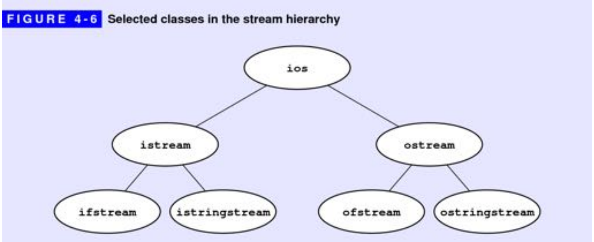

# CS106B 学习笔记

## chapter3

该章节主要是描述字符串处理内容。

## chapetr4

探索 C++ 中流(stream)存在那些特征，以及如何利用 stream 去处理文件数据。

`<<` 被称为插入运算符(insertion operation)，左侧为输出流，右侧为需要插入的数据。`<<` 通过重载操作符使得其可以输出不同类型的数据值。C++ 中利用一系列称为操纵器（manipulator）的东西实现格式化输出。有些操纵器是短暂的，仅仅影响下一个输出的字段，而有些操纵器则是持久的，直到显示调用改变其属性。

| manipulator | message |
| :---: | :---: |
| endl | 将换行结束符插入输出流
| setw(n) | 设置下一个字段输出为 n 个字符，若不足默认填充空格，该操作是短暂的
| setprecision(digits) | 设置数值的精度，该操作是持久的
| setfill(ch) | 设置流的填充为字符 ch，该操作是持久的
| left | 指定字段左对齐，持久操作
| right | 指定字段右对齐，持久操作
| intermal | 指定字段居中对齐，持久操作
| fixed | 指定浮点数具体显示数值，而不是科学计数法，持久操作
| scientific | 以科学计数法显示，持久操作
| showpoint/noshowpoint | 显示/不显示小数点，持久操作

#### Data file

持久存储数据在存储媒介中的数据集合称为**文件**。C++ 中头文件 `fstream` 中包含两个流处理类 `ifstream` 和 `ofstream` 用于处理文件的读取和写入。

读写文件的基本步骤：

```bash
1. 声明一个流变量引用该文件
    ifstream infile;
    ofstream outfile;
2. 打开文件
    infile.open("file.txt");
    由于流库的引入早于string 类，所以需要一个 C 风格的字符串表示
    infile.open(filename.c_str());
3. 转换数据
4. 关闭文件
    infile.close();
```

| 方法名 | 功能描述 |
| :---: | :---: |
| get(var) | 将文件流中的下一个字符以引用的方式存储到 var 变量中，并返回 stream
| get() | 返回文件流中的下一个字符
| clear() | 用于清除文件读写的错误标志
| fail() | 若文件读取发生错误，返回 true，否则返回 false
| close() | 关闭文件
| unget() | 撤回最近一个读取的字符，将其重新放回输入流中
| eof() | 若到达文件末尾则返回 true, 否则返回false
| operator>>() | 提取带格式的数据，跳过前导空格
| getline(infile, str) | 该函数是自由函数，传入两个引用参数，将读取的一行存储在 str 字符串中
| open(filename) | 打开文件


#### string streams

头文件 sstream 提供了一些类允许用户关联一个字符串和流，使得可以类似 fstream 中的方式处理字符串。主要是两个类 istringstream 和 ostringstream。

| 成员函数 | 功能说明
| :---: | :---: |
| str() | 获取流的字符串

#### 输出输出流的类层次结构




## Chapter5

根据行为而不是表示方式定义的类型称为抽象数据类型(Abstract Data Type)。本章主要介绍五个类别，Vector、Stack、Queue、Map 和 Set。

#### Vector

* 构造函数
  * `explicit vector( const Allocator& alloc );` 初始化空容器
  * `explicit vector( size_type count );` 构造 count 个默认值的容器
  * `explicit vector( size_type count, const T& value = T(), const Allocator& alloc = Allocator() );` 构造 count 个 元素值为 value 的容器
  * `vector( InputIt first, InputIt last, const Allocator& alloc = Allocator() );` 构造拥有范围[first, last)内容的容器
* push_back(value) 将元素 value 追加到容器末尾
* insert() 将元素插入到容器的指定位置
  * `iterator insert( const_iterator pos, const T& value );` 将元素 value 插入到容器 pos 之前
  * `iterator insert( const_iterator pos, size_type count, const T& value );` 在容器 pos 之前插入count 个元素 value 的副本
  * `iterator insert( const_iterator pos, InputIt first, InputIt last );` 在容器 pos 之前插入来自范围[first, last)的元素
  * `iterator insert( const_iterator pos, std::initializer_list<T> ilist );` 在容器 pos 之前插入初始化列表的元素
  * `vector( const vector& other );` 拷贝构造函数
  * `vector( std::initializer_list<T> init, const Allocator& alloc = Allocator() );` 使用初始化列表构造容器
* erase 从容器擦除指定元素
  * `iterator erase( iterator pos );` 移除容器 pos 处的元素
  * `iterator erase( iterator first, iterator last );` 移除容器 [first, last) 区间的元素
* 指定元素的获取
  * `reference at( size_type pos );` 返回指定位置的元素引用，并且做边界检查
  * `reference operator[]( size_type pos );` 返回指定位置的元素引用，不做边界检查
* `size_type size() const;` 返回容器元素个数
* `void clear();` 清除容器中所有元素

#### Stack

栈结构中数据遵循先进后出的原则。

* `void push( const value_type& value );` 将元素 value 推到栈顶
* `reference top();` 返回栈顶元素的引用
* `void pop();` 移除栈顶元素
* `size_type size() const;` 返回栈中元素个数

#### Queue

数据结构中存储元素使用先进先出（First In, Fisrt Out, FIFO）策略的称为队列。

* `void push( const value_type& value );` 将元素 value 入队
* `void pop();` 移除队列前端元素，无返回值
* `reference front();` 返回队列前端元素的引用，即最高进入队列的元素
* `reference back();` 返回最近进入队列的元素引用
* `bool empty() const;` 检查队列是否为空
* `size_type size() const;` 返回队列中的元素个数

#### Map

映射的概念类似于字典，可以通过一个单词找对其对应的解释。Map 提供了称为 Key 和 Value 之间的关联。C++ 中 Map是一种
**有序**关联容器，它包含**唯一键**的键值对。

* 构造函数
  * `explicit map( const Allocator& alloc );` 创建空的容器
  * `template< class InputIt > map( InputIt first, InputIt last, const Compare& comp = Compare(),const Allocator& alloc = Allocator() );` 范围构造容器
  * `map( std::initializer_list<value_type> init,const Compare& comp = Compare(),const Allocator& alloc = Allocator() );` 用初始化列表构造容器
* 修改器
  * `std::pair<iterator, bool> insert( const value_type& value );` 将元素插入容器，并返回一个 `std::pair`
  * `iterator insert( iterator pos, const value_type& value );` 在 value 插入到 pos 之前的位置
  * `template< class InputIt > void insert( InputIt first, InputIt last );` 插入来自范围 [first, last)范围内的元素
* 元素访问
  * `T& at( const Key& key );` 返回指定键值的元素的引用，若不存在对应的键值，则抛出`std::out_of_range`类型异常。
  * `T& operator[]( const Key& key );` 返回指定键值的元素的引用


#### Set

Set 类抽象了数学中的集合概念，该容器中的元素是无序的且每个元素只能出现一次。但是C++ std库中的set被实现为有序集合。

* 构造函数
  * `set();` 构造空的集合容器
  * `template< class InputIt > set( InputIt first, InputIt last, const Compare& comp = Compare(),const Allocator& alloc = Allocator() );` 以范围[first, last)内元素构造集合容器
  * `set( const set& other );` 拷贝构造函数
  * `set( std::initializer_list<value_type> init, const Compare& comp = Compare(),const Allocator& alloc = Allocator() );` 以初始化列表元素构造集合容器
* 容量
  * `bool empty() const;` 检查集合容器是否为空
  * `size_type size() const;` 返回集合容器的元素个数
* 修改器
  * `std::pair<iterator, bool> insert( const value_type& value );` 将元素插入集合容器
  * `iterator insert( iterator pos, const value_type& value );` 将元素插入到位置 pos 之前
  * `iterator insert( iterator pos, const value_type& value );` 将范围[first, last)元素插入容器
  * `void insert( std::initializer_list<value_type> ilist );` 将初始化列表元素插入容器
  * `iterator erase( iterator pos );` 移除指定位置的元素
  * `iterator erase( iterator first, iterator last );` 移除指定范围内的元素
  * `size_type erase( const Key& key );` 移除键值等于key的元素
  * `size_type count( const Key& key ) const;` 返回容器中键值等于key的元素个数，由于集合容器元素具有唯一性，只能返回0或1
  * `template< class C2 > void merge( std::set<Key, C2, Allocator>& source );` 尝试提取source中的每个元素到当前容器中，并用`*this`的比较对象插入到`*this`。若`*this`存在source中的键值，则不提取该元素。合并过程不复制和移动元素，只会重定向容器结点的内部指针。
  * `iterator find( const Key& key );` 寻找键值等于key的元素并返回其位置，若不存在，则返回尾后迭代器（end()

## Chapter 6 Designing Classes

#### Representing points

* 结构体定义

```C++
// 使用点运算符访问成员
struct Point{
  int x;
  int y;
};

Point p;
p.x = 10;
p.y = 2;
```

* 类（class）定义

```C++
class Point{
public:
    Point(){
    };
    Point(int cx, int cy){
        x = cx;
        y = cy;
    }
    int Getx(){
        return x;
    }
    int Gety(){
        return y;
    }
    void showPoint(){
        cout << "(" << x <<", " << y << ")" << endl;
    }
private:
    int x;
    int y;
};
```

#### Operator overloading(操作符重载)

```C++
class Point{
public:
    // ...
    // 友元函数
    friend ostream& operator<<(ostream& out, Point p);
private:
    int x;
    int y;
};
// 运算符重载
ostream& operator<<(ostream& out, Point p){
    out << "(" << p.x <<", " << p.y << ")";
    return out;
}
```

* 重载 `++` 运算符，存在前缀`++`和后缀`++`两种形式

```C++
// 重载前缀++
type operator++(type ..., ){
  ...
}
// 重载后缀++
type operator++(type ..., int){
  ...
}
```

#### Rational numbers

* 设计一个新类所需的策略
  * 从用户的角度出发考虑
  * 确定那些信息应该属于私有变量
  * 定义一系列构造函数进行类的创建
  * 确定需要暴露的类公开方法
  * 代码和代码测试的实现

# 现代C++教程

## Chatpter2 语言可用性的强化

#### 常量

* nullptr 用于区分空指针和0。

* constexpr 常量表达式，用于在编译期间计算，获取确定值，提供代码性能

* 初始化列表的概念绑定至类型上，称之为 std::initializer_list，允许函数像其它类型参数一样传递

```C++
void foo(initializer_list<int> x){
    for(auto it = x.begin(); it != x.end(); it++){
        cout << *it << endl;
    }
}
```

* 结构化绑定

```C++
tuple<int, double, string> f(){
    return make_tuple(1, 2.3, "hello");
}

int main(){
    auto [x, y, z] = f();
    cout << x << y << z << endl;
    return 0;
}
```

* 类型推导，关键字 `auto`和`decltype`实现了类型推导
  * `auto` 无法用于函数传参，且无法用于数组类型推导
  * `decltype`是为了解决`auto`只能推导变量， `decltype(表达式)`
  * 尾返回类型推导

#### 控制流

* `if constexpr`

```C++
#include <iostream>

template<typename T>
auto print_type_info(const T& t) {
    // 编译期间确定条件判断
    if constexpr (std::is_integral<T>::value) {
        return t + 1;
    } else {
        return t + 0.001;
    }
}
int main() {
    std::cout << print_type_info(5) << std::endl;
    std::cout << print_type_info(3.14) << std::endl;
}
```

* 区间 for 迭代

```C++
#include <iostream>
#include <vector>
#include <algorithm>
int main() {
    std::vector<int> vec = {1, 2, 3, 4};
    if (auto itr = std::find(vec.begin(), vec.end(), 3); itr != vec.end()) *itr = 4;
    for (auto element : vec)
        std::cout << element << std::endl; // read only
    for (auto &element : vec) {
        element += 1;                      // writeable
    }
    for (auto element : vec)
        std::cout << element << std::endl; // read only
}
```